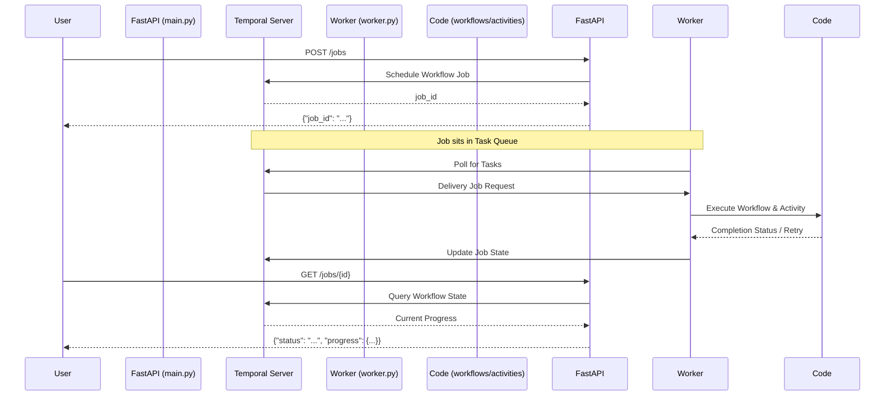

# Minimal FastAPI + Temporal Integration (Screenshot Specs)

This project implements a FastAPI service integrated with Temporal, strictly following the requirements from the provided documentation screenshot.

## Prerequisites

- **Docker & Docker Compose** (Recommended) or [Temporal CLI](https://docs.temporal.io/cli).
- Python 3.9+

## Setup & Running

### 1. Start Temporal Infrastructure
Use the provided Docker Compose configuration to start the Temporal server and its dependencies:
```bash
cd docker-compose
docker-compose up -d
```
*Note: It may take 30-60 seconds for the containers to fully initialize on the first run.*

### 2. Install Python Dependencies
```bash
pip install fastapi uvicorn temporalio requests
```

### 3. Start the Worker (New Terminal)
The worker hosts your logic (`activities.py` and `workflows.py`):
```bash
python worker.py
```

### 4. Start the FastAPI App (New Terminal)
```bash
uvicorn main:app --reload
```

## API Usage (Screenshot Match)

### 1. Start a Job
```bash
curl -X POST "http://localhost:8000/jobs" \
     -H "Content-Type: application/json" \
     -d '{
       "input": {"numbers": [1, 2, 3, 4]},
       "options": {"fail_first_attempt": true}
     }'
```

### 2. Query Job Status + Progress
```bash
curl "http://localhost:8000/jobs/{job_id}"
```

### 3. Automated Testing
You can also run the automated test script to observe the retry behavior:
```bash
python test_service.py
```

## Project Structure

- **`main.py`**: FastAPI endpoints that act as the client to the Temporal server.
- **`worker.py`**: The process that connects to Temporal and waits to execute tasks.
- **`workflows.py`**: Orchestrates the business logic, timeouts, and retry policies.
- **`activities.py`**: Contains the actual unit of work (summing) and handles failures.

## How it Works (Lifecycle)



## Verification & Logic
- **Controlled Failure**: When `fail_first_attempt: true` is passed, `activities.py` raises an error on the first run.
- **Retry Policy**: `workflows.py` defines a policy that retries every 1s.
- **Progress Tracking**: 
  - The `attempt` field is initialized to `1` when the workflow starts.
  - It is updated to the final successful attempt count once the activity completes.
  - The activity still sends **heartbeats** to ensure the server knows it is alive during the 10s processing delay.
